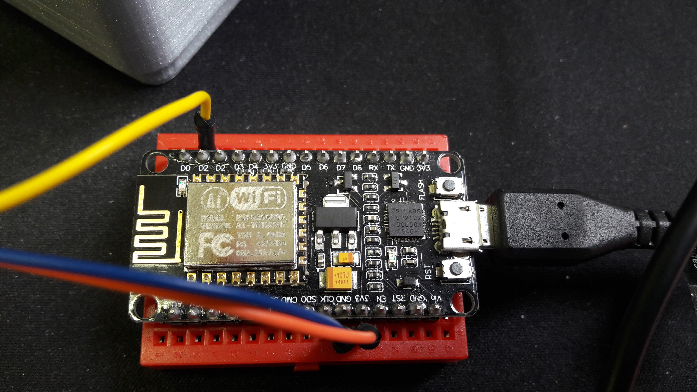
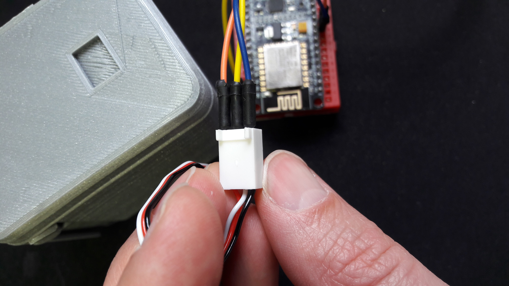

= NodeMCU ESP8266 standalone
François Roland <francois.roland@umons.ac.be>
2019-10-03

== Files

* MoveServo.ino[] Moves the servo from 0 to 170° by step of 10°.

video::move-servo.mp4[the servo moves the bar]
