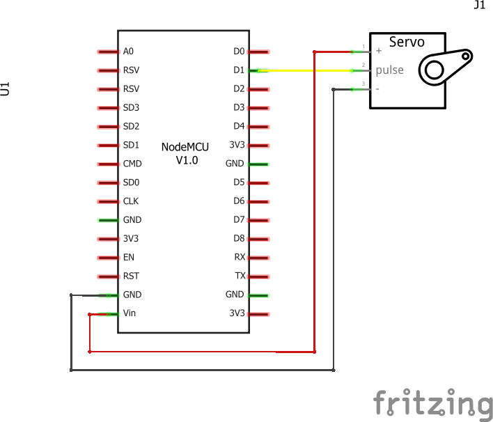
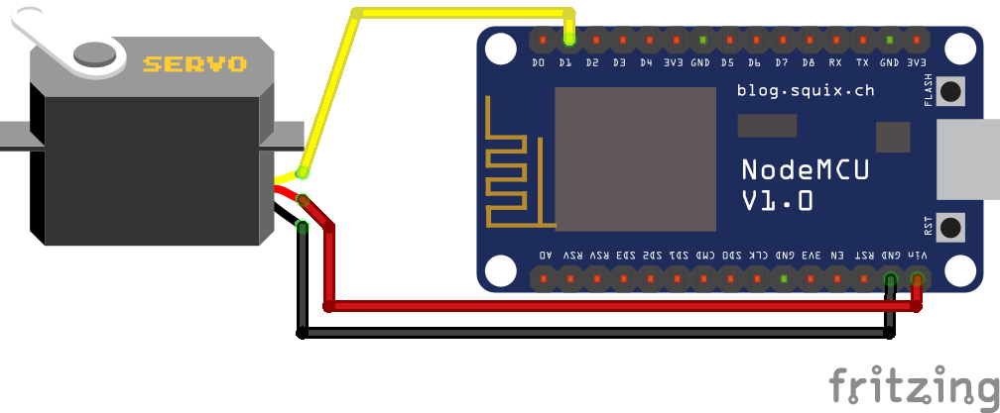

:title-separator: {sp}|
= Ateliers Créactifs Fab-IoT-Lab | Créez votre objet connecté
François Roland <francois.roland@umons.ac.be>
4 octobre 2018
:icons: font

== Protocole

=== Etape 1 : Installation
* Installer <<Arduino>>
* Installer ESP8266 core <<ESP8266ArduinoCore>>
* Configurer NodeMCU comme plateforme par défaut

=== Etape 2 : Prise en main de l’interface Arduino
* Création d’un nouveau sketch
* Ecriture d’un programme "HelloWorld + LED Blink" écrivant sur le port série
* Vérification à l’aide d’un programme lisant le port série

=== Etape 3 : Contrôle du Servo
* Ecriture d’un programme utilisant la librairie "servo" ; la commande est envoyée via le port série
* Utilisation d’une interface vers le port série pour envoyer la commande

=== Etape 4 : Connexion au réseau WiFi - version DHCP
* Ecriture d’un programme permettant de se connecter à un réseau WiFi à l’aide de la libraire ESP8266WIFI :
** Configurer le microcontrôleur en mode station
** SSID : `UMONS-VISITOR`
** Password : `43Zi11t3HiWv1E3Y`
** Mode : DHCP (mode par défaut)
* Récupérer, via le port série, la valeur
** De "Hostname"
** De l’adresse MAC
** Des paramètres IP (votre IP, IP Gateway, netmask)

=== Etape 5 : Connexion au réseau WiFi – version IP statique
* Ecriture d’un programme permettant de se connecter à un réseau WiFi à l’aide de la libraire ESP8266WIFI :
** Configurer le microcontrôleur en mode station
** SSID : `UMONS-VISITOR`
** Password : `43Zi11t3HiWv1E3Y`
** Mode : statique

NOTE: Pour cela, imposer les paramètres "IP", "IP Gateway" et "netmask".
Choisissez une IP entre 10.105.90.200 et 10.105.90.220.

== Connexion NodeMCU - servomoteur

Le servomoteur SG90 est prévu pour être alimenté en 5V.
Le microcontrôleur NodeMCU fonctionne en 3,3V.
Par contre, la connexion USB fournit du 5V.
Nous pouvons donc connecter l'alimentation du servomoteur sur la pin Vin du microcontrôleur, de manière à profiter directement de l'alimentation USB.

La commande du servomoteur se fait à l'aide d'une largeur d'impulsion <<SG90>>.
L'expérience montre que l'électronique du servomoteur est suffisamment sensible que pour détecter cette impulsion même si la tension de crête ne monte qu'à 3.3V.
Ceci nous permet donc de commander le servomoteur à partir de notre NodeMCU sans courir de risque pour le microcontrôleur ou le servo.

.Schéma de connexion du servomoteur sur le NodeMCU

.Représentation physique de la connexion du servomoteur sur le NodeMCU

[bibliography]
== Ressources

- [[[VanLaere2017]]] Aurélien Van Laere (2017). _Atelier Créactif: Fab-IoT-Lab_. Mons : Université de Mons.
- [[[SG90]]] Datasheet SG90. _SG90 9g Micro Servo_. Sur https://cdn.hackaday.io/files/11936510669824/SG90Servo.pdf. Page consultée le 04/10/2018.
- [[[Arduino]]] _Arduino IDE_. Sur https://www.arduino.cc/en/Main/Software. Page consultée le 04/10/2018.
- [[[ESP9266ArduinoCore]]] _ESP8266 core for Arduino_. Sur https://arduino-esp8266.readthedocs.io/en/latest/index.html. Page consultée le 04/10/2018.
- [[[Putty]]] Moniteur port série. _PuTTY: a free SSH and Telnet client_. Sur https://www.chiark.greenend.org.uk/~sgtatham/putty/latest.html. Page consultée le 04/10/2018.
- [[[ServoLib]]] Librairie servomoteur. _Servo Library_. Sur https://www.arduino.cc/en/reference/servo. Page consultée le 04/10/2018.
- [[[SerialLib]]] Librairie port série. _Serial_. Sur https://www.arduino.cc/reference/en/language/functions/communication/serial/. Page consultée le 04/10/2018.
- [[[ESP8266WiFiLib]]] Libraire WiFi pour ESP8266_ESP8266WiFi Library_. Sur https://arduino-esp8266.readthedocs.io/en/latest/esp8266wifi/readme.html. Page consultée le 04/10/2018.

== Pour aller plus loin

* FUN-MOOC Objets connectés : des radiofréquences aux réseaux
https://www.fun-mooc.fr/courses/course-v1:univ-toulouse+101003+session02/info
* FUN-MOOC Fabriquer un objet connecté
https://www.fun-mooc.fr/courses/MinesTelecom/04018S02/session02/info
* Youtube Channel Andreas Spiess - My ESP32 videos
https://www.youtube.com/channel/UCu7_D0o48KbfhpEohoP7YSQ

